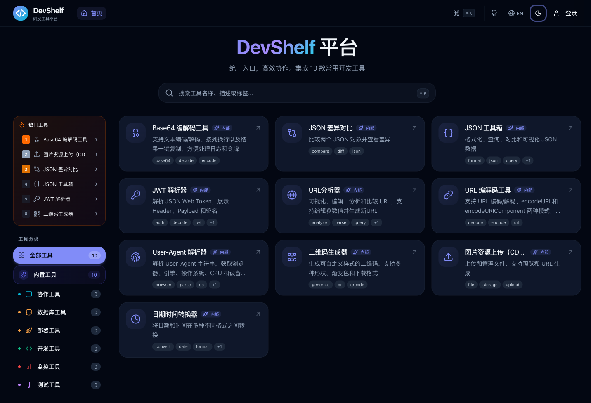

<div align="center">


# DevShelf

**Your team's developer tool shelf — organized, searchable, always within reach.**

[English](README.md) | [简体中文](README.zh-CN.md)

Manage your team's developer tools, internal links, and environment URLs in one place. Self-hosted on Cloudflare Workers. Deploy in 30 seconds.

[](https://deploy.workers.cloudflare.com/?url=https://github.com/Muluk-m/dev-shelf)

[](LICENSE)
[](https://www.typescriptlang.org/)
[](https://workers.cloudflare.com/)
[](https://react.dev/)

</div>

---



## Why DevShelf?

Every team maintains a growing list of internal tools, dashboards, APIs, and services scattered across bookmarks, wikis, and Slack messages. DevShelf gives them a home.

- **One place for all tools** — No more "where's the link to staging?" in Slack
- **Multi-environment URLs** — Dev / Staging / Prod links for every tool, one click away
- **Zero infrastructure cost** — Runs on Cloudflare's free tier (Workers + D1 + KV)
- **30-second deploy** — Click the button, get a running instance. No Docker, no VMs, no config files
- **Own your data** — Self-hosted, export to JSON anytime, no vendor lock-in

## Features

<table>
<tr>
<td width="50%">

### Tool Management
Full CRUD with categories, tags, and environment links. Organize hundreds of tools without losing track.

### Command Palette
Press `Cmd/Ctrl + K` to instantly search and jump to any tool. Keyboard-first workflow.

### Role-Based Access
Admin and User roles. Admins manage tools; users browse and favorite. First-run wizard creates the admin account.

</td>
<td width="50%">

### Multi-Environment URLs
Every tool can have Dev, Staging, and Production URLs. One click to open the right environment.

### Built-in Utilities
JSON formatter, Base64 encoder/decoder, URL parser, and more — right in your tool shelf.

### Data Export
Admin can export all tools, categories, and tags as a single JSON file for backup or migration.

</td>
</tr>
</table>

### Also includes

- Light / Dark theme (follows system preference)
- Responsive design (desktop & mobile)
- Edge-deployed worldwide via Cloudflare Workers
- D1 database (SQLite at the edge, zero cold starts)
- User favorites and recently used tools

## Quick Start

### One-Click Deploy

The fastest way to get DevShelf running. Automatically provisions Workers, D1 database, and KV namespace.

<div align="center">

[](https://deploy.workers.cloudflare.com/?url=https://github.com/Muluk-m/dev-shelf)

</div>

After deployment:

1. Set the JWT secret: `wrangler secret put JWT_SECRET` (use `openssl rand -hex 32` to generate)
2. Visit your deployed URL
3. Complete the setup wizard to create your admin account
4. Start adding your team's tools

### Manual Deployment

<details>
<summary>Click to expand step-by-step instructions</summary>

#### Prerequisites

- [Cloudflare account](https://dash.cloudflare.com/sign-up) (free tier works)
- [Node.js](https://nodejs.org/) (LTS)
- [pnpm](https://pnpm.io/installation)
- [Wrangler CLI](https://developers.cloudflare.com/workers/wrangler/install-and-update/): `npm install -g wrangler`

#### Steps

```bash
# 1. Clone the repository
git clone https://github.com/Muluk-m/dev-shelf.git
cd dev-shelf

# 2. Install dependencies
pnpm install

# 3. Authenticate with Cloudflare
wrangler login

# 4. Create the D1 database
wrangler d1 create devhub-database
# Copy the database_id from the output and update wrangler.jsonc

# 5. Apply database migrations
wrangler d1 migrations apply DB --remote

# 6. Set the JWT secret
wrangler secret put JWT_SECRET
# Enter a strong random string (generate with: openssl rand -hex 32)

# 7. Deploy
pnpm run deploy
```

Visit your deployed URL and complete the setup wizard.

</details>

## Local Development

```bash
# Clone and install
git clone https://github.com/Muluk-m/dev-shelf.git
cd dev-shelf
pnpm install

# Configure environment
cp .dev.vars.example .dev.vars
# Edit .dev.vars and set JWT_SECRET=any-local-dev-secret

# Set up local database
pnpm run db:migrate:local

# Start dev server
pnpm run dev
# Open http://localhost:5173
```

<details>
<summary>All available commands</summary>

| Command | Description |
|---------|-------------|
| `pnpm run dev` | Start development server with hot reload |
| `pnpm run build` | Build for production |
| `pnpm run preview` | Preview production build locally |
| `pnpm run deploy` | Build, migrate, and deploy to Cloudflare |
| `pnpm run typecheck` | Run TypeScript type checking |
| `pnpm run lint` | Check code quality with Biome |
| `pnpm run lint:fix` | Auto-fix linting issues |
| `pnpm run cf-typegen` | Generate Cloudflare binding types |
| `pnpm run db:migrate` | Apply migrations to remote D1 |
| `pnpm run db:migrate:local` | Apply migrations to local D1 |

</details>

## Environment Variables

| Variable | Type | Required | Description |
|----------|------|----------|-------------|
| `JWT_SECRET` | Secret | Yes | Key for signing auth tokens. Generate: `openssl rand -hex 32` |
| `API_BASE_URL` | Var | No | Public URL (auto-detected if empty) |
| `DB` | D1 Binding | Auto | Application database |
| `CACHE_KV` | KV Binding | Auto | Response cache |

Secrets are set via `wrangler secret put`. Vars are in `wrangler.jsonc`. Bindings are auto-provisioned by Deploy Button.

## Tech Stack

| Layer | Technology |
|-------|------------|
| Frontend | React 19, React Router 7, Tailwind CSS 4, shadcn/ui |
| Backend | Hono on Cloudflare Workers |
| Database | Cloudflare D1 (SQLite at the edge) |
| Cache | Cloudflare KV |
| Language | TypeScript 5.8 |
| Tooling | pnpm, Biome, Vite |

## Project Structure

```
dev-shelf/
├── app/                    # Frontend (React Router v7)
│   ├── components/         # UI components
│   ├── hooks/              # Custom hooks
│   ├── lib/                # Utilities & API client
│   ├── routes/             # Page routes
│   └── stores/             # Zustand state
├── workers/                # Backend API (Hono)
│   ├── middleware/          # Auth & RBAC
│   └── routes/             # API endpoints
├── lib/                    # Shared code
│   └── database/           # D1 operations
├── migrations/             # D1 schema migrations
├── wrangler.jsonc          # Cloudflare config
└── .dev.vars.example       # Env var template
```

## Contributing

Contributions are welcome! Please feel free to submit a Pull Request.

## License

[MIT](LICENSE)
